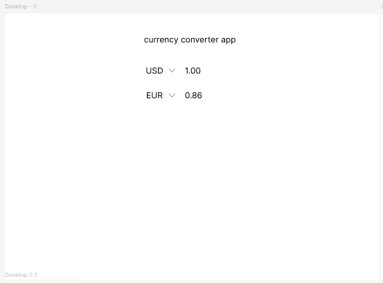
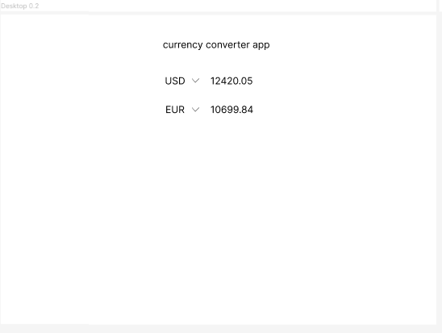
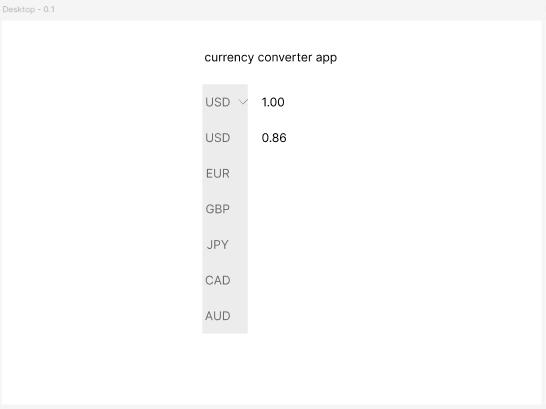
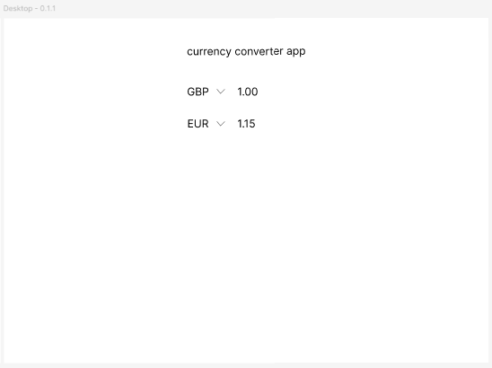
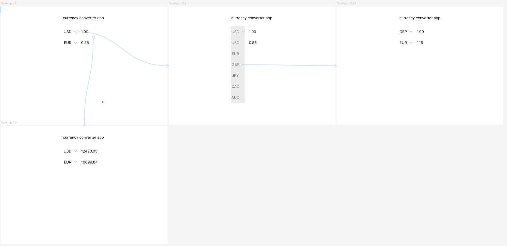
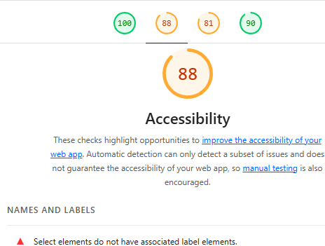

# SE_summative

## Proposal
The objective of this project is to design and implement a simple, web-based Currency Converter App that allows users to convert numeric values between widely used currencies. The app is intended as a minimal, functional tool with a clean interface, focused on usability and clarity, rather than exhaustive features or extensive currency coverage. The core goal is to demonstrate proficiency in front-end development using HTML, CSS, and JavaScript, while integrating modern software engineering practices such as Test-Driven Development (TDD), automated testing with Jest, and continuous integration and deployment (CI/CD) using GitHub Actions.

Firstly, it provides an opportunity to practice the entire software development lifecycle in a small, manageable project. From initial requirements gathering and prototyping through coding, testing, and deployment, the project offers a taste of real-world software development.

Secondly, it demonstrates the application of automated workflows, showing that even a simple project can benefit from best practices in version control, testing, and deployment automation.

The scope of the project is deliberately constrained to ensure focus and clarity. The app includes interactive numeric inputs, dropdown-based currency selection, real-time bidirectional updates between input fields, and static conversion rates for simplicity. The final deliverable will be deployed online, accessible via GitHub Pages, and accompanied by full documentation and testing evidence to support evaluation.
## Design & Prototyping
The Figma prototype for the Currency Converter App demonstrates the intended user interface and basic interactions. The design is minimal, with a white background and text elements positioned higher on the page to allow space for the dropdown menus.
### Layout
- Title: "Currency Converter App" at the top.
- Currency Selection: Two stacked dropdown boxes for currency codes (GBP, USD, EUR).
- Value Input: Each dropdown has a corresponding numeric input box for entering a value. The value in one box automatically updates the other to two decimal places.
### Interactions
The prototype illustrates two main interaction paths:
1. Changing Currency:
 - Click the dropdown arrow to view the list of supported currencies.
 - Select a currency (for example, GBP).
 - The top currency updates and the bottom value box recalculates automatically.
2. Changing Value:
 - Click the top value box on the first page to simulate entering a new value.
 - The next page shows the updated corresponding value in the bottom box.
### Main Page

### Recalculate by changing amount

### Dropdown Selection

### Currency change

### Interactions
The link to the figma design can be found [here](https://www.figma.com/design/NkJTdkXotMxNGNgTv1rJ5r/currency-converter-prototype?node-id=1-2518)
## Project Management Tools
The development of the Currency Converter App was supported by a range of project management tools, primarily within the GitHub ecosystem, to ensure organization, accountability, and traceability throughout the development cycle.
### Git and Branching Strategy
Git was used as the core version control system, with a branch-per-feature workflow. Each new feature - such as the HTML/CSS layout, currency conversion logic, test implementation, or CI/CD configuration - was developed on its own branch. This approach allowed isolated development and reduced the risk of introducing bugs into the main branch. Pull requests (PRs) were used to merge completed features into main, providing a structured mechanism for reviewing changes before integration.
### GitHub Issues
GitHub Issues served as the primary task management system. Each task, bug, or enhancement was recorded as a separate issue, with clear descriptions and acceptance criteria. This allowed the work to be broken down into discrete, manageable units and provided a clear overview of the project’s requirements and outstanding tasks.
### GitHub Projects
To visualize and track progress, issues were organized within a GitHub Project board, with columns representing stages such as “To Do,” “In Progress,” and “Done.” This enabled rapid assessment of project status at any moment and helped maintain focus on the most immediate priorities.
### Linking Issues to Pull Requests
Whenever a feature branch was ready to be merged, the corresponding pull request was linked to its related issue. This ensured that every implemented feature could be traced back to a clearly defined task, supporting accountability and documentation of the development process.
### Risk Mitigation
Using this combination of tools reduced risks such as untracked work, code conflicts, or CI failures. Clear commit messages referencing issues and automated testing within CI/CD pipelines ensured that all work was verifiable, reliable, and aligned with the project objectives.
## Narration of Development
The development of the Currency Converter App began with the creation of a clear and minimal design in Figma. The prototype established the layout and user interactions, including two stacked currency input rows, dropdowns for currency selection, and bidirectional value updates. Establishing the prototype first allowed the development process to proceed with a concrete reference for UI placement and interaction behavior, reducing ambiguity during coding.

Once the design was finalized, the initial codebase was created. HTML and CSS were implemented first to establish the structure and styling of the application. This included two input rows, dropdown menus for currency selection, and a responsive layout that kept the interface simple and uncluttered. By focusing on the static layout first, it became possible to progressively layer functionality without compromising visual clarity.

The next step involved implementing the currency conversion logic. Guided by Test-Driven Development principles, Jest tests were written before the functional code. Two core tests were defined to ensure that conversion between GBP, USD, and EUR produced the correct numeric results. With these tests in place, the conversion function was implemented in currencyConverter.js, using predefined static rates. Writing tests first ensured that development remained goal-oriented and prevented regressions during subsequent feature additions.

After confirming that the core conversion logic passed tests, the DOM manipulation layer in script.js was added. Event listeners were attached to input fields and dropdowns to trigger recalculation whenever a value or currency was changed. Bidirectional updates were carefully implemented so that changing either input would update the other in real time, maintaining accuracy to two decimal places.

With functional code in place, a CI/CD pipeline was configured using GitHub Actions. Automated workflows were added to run Jest tests on each push or pull request, providing instant feedback on code quality. Successful runs automatically triggered deployment to GitHub Pages, ensuring that the latest version of the app was always publicly accessible. This integration of CI/CD reinforced best practices and ensured that even rapid development remained verifiable and stable.

Throughout the process, GitHub Issues and Projects were used to track tasks, link them to pull requests, and provide a clear record of development decisions. Commits were granular and descriptive, allowing easy tracing of changes and facilitating the review process. By combining prototyping, TDD, modular development, and automated deployment, the project was completed efficiently while demonstrating disciplined software engineering practices.
## User Documentation
The Currency Converter App provides a simple interface for converting numeric values between GBP, USD, and EUR. Users interact with two stacked input rows. Each row contains a numeric input box and a dropdown menu for selecting the currency. The design focuses on clarity and ease of use so conversions can be completed quickly and accurately.
### How to Use:
- Open the app in your browser at the live GitHub Pages URL.
- Select the desired currency from the dropdown menus for each input row.
- Enter a numeric value in either input box. The other input box will automatically update with the converted value to two decimal places.
- Changing the selected currency in either dropdown will recalculate the corresponding value immediately.
### Features and Notes
- Only numeric input is accepted. Non-numeric characters are ignored.
- The app uses static conversion rates: USD equals 1.34 and EUR equals 1.15 relative to GBP.
- Users can change either input field to update the other, supporting bidirectional conversion.
- The interface is minimalistic and responsive, allowing users to focus on the conversion without distractions.
### Accessibility
The app is compatible with modern web browsers and does not require installation. The layout and form elements are designed to be intuitive and accessible, ensuring that any user can perform currency conversions without additional instructions.
## Technical Documentation
### Code Structure and Responsibilities
The application is built using plain HTML, CSS, and JavaScript, with Jest used for testing.
- `static.html` defines the structure of the user interface, including the currency dropdowns and input fields.
- `styles.css` contains all layout and styling rules.
- `currencyConverter.js` contains the core currency conversion logic and the static exchange rates.
- `script.js` connects the conversion logic to the user interface by handling user input and updating the DOM.
- `currencyConverter.test.js` contains unit tests for the conversion logic.
- `.github/workflows/ci.yml` defines the continuous integration workflow.
This separation ensures that business logic can be tested independently from the browser based user interface.
### Currency Conversion Logic
Exchange rates are defined as static values inside `currencyConverter.js.` GBP is treated as the base currency, with USD set to 1.34 and EUR set to 1.15. The `convertCurrency` function takes four inputs: the amount, the source currency, the target currency, and the rates object. Conversion is performed by converting the input amount to GBP first, then converting from GBP to the target currency. The final value is rounded to two decimal places.
### User Interface Logic
In `script.js`, event listeners are attached to both numeric input fields and both currency dropdown menus. When a user enters a value or changes a selected currency, the conversion function is called and the corresponding value is updated. The logic supports bidirectional updates so that editing either input field recalculates the other. Browser level validation is applied using `type="number"` and a step value of `0.01`.
### Running the Application Locally
To run the application locally:
- Clone the repository from GitHub.
- Open the project folder.
- Open `static.html` in a modern web browser.
No build step or server is required since the application runs entirely in the browser.
### Running Tests Locally
To run the tests locally, Node.js must be installed.
- Go to the project directory in a terminal.
- Install dependencies by running `npm install`.
- Run the test suite using `npm test`.
Jest will execute the unit tests in `currencyConverter.test.js` and report whether the conversion logic behaves as expected. The GitHub Actions workflow automatically runs the same tests on every push and pull request. If any test fails, the workflow fails, preventing broken code from being merged.
## Evaluation
From a usability perspective, the application follows recognised principles of simplicity and clarity. Nielsen’s usability heuristics emphasise reducing cognitive load and ensuring that system status is visible to the user (Nielsen, 1994). The app achieves this through a minimal interface that limits user choices to essential inputs and provides immediate feedback through real time bidirectional conversion. Users can understand how to operate the app without additional instructions, which aligns with the principle of recognition rather than recall.

In terms of functional correctness, the application performs accurate currency conversion using predefined static exchange rates. This approach supports predictability and testability, which is appropriate for small scale applications and educational contexts (Beck, 2003). The bidirectional input logic functions consistently and avoids circular update errors, indicating correct handling of application state. However, the use of static exchange rates limits the realism of the product, as real world currency values fluctuate. While acceptable for demonstration purposes, this reduces its suitability for real financial decision making.

I evaluated accessibility using Google Lighthouse. The results shown in the screenshot indicated an accessibility score of 88. This suggests generally good accessibility practices but highlights missing label associations for form elements. The Web Content Accessibility Guidelines state that form inputs must have programmatically associated labels to support screen reader users and keyboard navigation (W3C, 2018).

 It is also important to note that automated tools such as Lighthouse can only detect a subset of accessibility issues, meaning manual testing would be required for full compliance (Google, 2024).

From a maintainability and quality assurance perspective, the separation of conversion logic from the user interface improves testability and long term maintainability. The inclusion of automated tests and continuous integration aligns with modern software engineering practices, where frequent testing reduces defects and improves code stability (Fowler, 2006). These practices add value despite the product being small in size.

Overall, the product meets its functional and educational goals while demonstrating sound engineering principles. The primary areas for improvement relate to accessibility compliance and the use of dynamic data sources. These limitations are clearly identifiable and could be addressed through future iterations.
### References
- Beck, K. (2003). Test Driven Development: By Example. Boston: Addison-Wesley
- [Fowler, M. (2006). Continuous Integration](https://martinfowler.com/articles/continuousIntegration.html) (Accessed: 16 January 2026)
- [Google (2024). Lighthouse accessibility scoring](https://developer.chrome.com/docs/lighthouse/accessibility/) (Accessed: 16 January 2026)
- Nielsen, J. (1994). Usability Engineering. San Diego: Academic Press
- [W3C (2018). Web Content Accessibility Guidelines (WCAG) 2.1](https://www.w3.org/TR/WCAG21/) (Accessed: 16 January 2026).